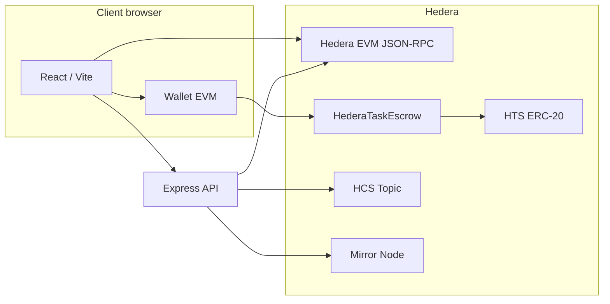

# JudgeBuddy (EscrowSwap Pro)

**Trust-minimized task escrow on [Hedera](https://hedera.com)** — clients lock **HTS / ERC-20** funds in an on-chain contract; **only the verifier** can release payout to the worker or refund the client. Off-chain orchestration, HCS audit, and a React dashboard tie the flow together.

---

## Why Hedera

| Capability | How we use it |
|------------|----------------|
| **Hedera EVM (chain 296)** | `HederaTaskEscrow` — `fundTask`, verifier-only `release` / `refund` |
| **HTS as ERC-20** | Same demo tokens (`0.0.…`) work in the UI, mirror, and `ethers` |
| **HCS** | Optional append-only messages on create / fund / submit / verify (operator topic) |
| **Mirror REST** | Resolve `0.0.x` accounts & tokens → `evm_address` for escrow wiring |
| **Low, predictable fees** | Fits micro-jobs and agent payouts |

---

## Features (judges / criteria)

- **On-chain escrow** — Funds are in `HederaTaskEscrow`, not a single custodial API key (verifier still must sign `release` / `refund` from their wallet).
- **Role separation** — Client (fund), worker (deliver), verifier (approve or reject path).
- **Dual mode** — With `ESCROW_CONTRACT_ADDRESS`: HTS ERC-20 + EVM flow. Without it: legacy operator + HBAR/HTS demo path.
- **Traceability** — Task store + optional **HCS** topic Mirror / HashScan links in the UI.
- **Wallet-aware UX** — Associate / approve / fund on Hedera EVM; guards for wrong wallet vs `clientEvm` and balance checks.
- **Hackathon shell** — Extra routes under `/hackathon/*` for event-style views (index, live, submissions, agent pipeline).

---

## Architecture



1. **Frontend** — Tasks CRUD via REST; escrow txs via `ethers` + injected wallet (HashPack / MetaMask on testnet).
2. **API** — JSON task store (`server/data/tasks.json`), mirror-backed EVM resolution, `POST /tasks/:id/onchain-sync` to align state with the contract.
3. **Smart contract** — OpenZeppelin `SafeERC20`; task id matches API-assigned id.

---

## Tech stack

- **UI:** React 18, Vite, TypeScript, Tailwind, shadcn/ui, Framer Motion, React Router  
- **Chain:** `ethers` v6, Hardhat, `@openzeppelin/contracts`, Hedera testnet EVM  
- **Server:** Node, Express, `@hashgraph/sdk`, optional `hedera-agent-kit` / HCS helpers  
- **Auth (optional):** Reown / WalletConnect (`VITE_WALLETCONNECT_PROJECT_ID`)

---

## Prerequisites

- Node **18+** and npm  
- Hedera **testnet** accounts with **HBAR** + (for escrow) **USDC** or your HTS token — see [.env.example](.env.example)  
- For live HCS + legacy transfers: operator id + key and `HCS_TOPIC_ID`

---

## Quick start

```bash
git clone <your-repo-url> escrowswap-pro
cd escrowswap-pro
npm install
cp .env.example .env
# Edit .env — see “Configuration” below
npm run dev:all
```

- **Web:** http://localhost:5173 (Vite default)  
- **API:** http://localhost:3001 (`PORT` in `.env`)

Health check: `GET http://localhost:3001/health`

---

## Configuration

Copy [.env.example](.env.example) to `.env` at the **repo root** (server loads the same file).

**Minimum to run against the real API (no mock):**

| Variable | Purpose |
|----------|---------|
| `VITE_ESCROW_USE_MOCK=false` | Use API + live tasks |
| `VITE_HEDERA_API_URL=http://localhost:3001` | Backend URL |

**On-chain escrow (hackathon demo):**

| Variable | Purpose |
|----------|---------|
| `DEPLOYER_EVM_PRIVATE_KEY` | Hardhat deployer (never commit) |
| `ESCROW_CONTRACT_ADDRESS` | Deployed `HederaTaskEscrow` (server) |
| `VITE_ESCROW_CONTRACT_ADDRESS` | Same address (frontend) |
| `HEDERA_EVM_RPC` / `VITE_HEDERA_EVM_RPC` | e.g. `https://testnet.hashio.io/api` |
| `VITE_HEDERA_USDC_TOKEN_ID` | HTS id with mirror + EVM path (default demo `0.0.429274`) |

**HCS + operator (optional):**

| Variable | Purpose |
|----------|---------|
| `HEDERA_NETWORK`, `HEDERA_ACCOUNT_ID`, `HEDERA_PRIVATE_KEY` | SDK operator |
| `HCS_TOPIC_ID` | Topic for audit messages |
| `HEDERA_DRY_RUN=true` | Skip paid txs while iterating |

**OpenAI project segmentation queue:**

| Variable | Purpose |
|----------|---------|
| `OPENAI_API_KEY` | Enables the OpenAI-backed segmentation worker |
| `OPENAI_SEGMENT_MODEL` | Model used for project segmentation (`gpt-4o-mini` by default) |
| `OPENAI_BASE_URL` | Optional proxy/base URL override for the Responses API |
| `OPENAI_SEGMENT_TIMEOUT_MS` | Request timeout for segmentation jobs |
| `PROJECT_SEGMENTATION_STORE_PATH` | Optional JSON store path for queued Hedera project events |
| `HEDERA_QUEUE_SHARED_SECRET` | Optional shared secret required by `POST /hedera/project-events` |

---

## Deploy escrow contract (testnet)

From repo root, after `.env` includes `DEPLOYER_EVM_PRIVATE_KEY` and RPC:

```bash
npm run compile:escrow
npm run deploy:escrow:testnet
```

Set the printed address in **`ESCROW_CONTRACT_ADDRESS`** and **`VITE_ESCROW_CONTRACT_ADDRESS`**, then restart `dev:all`.

---

## Judge demo script (happy path)

1. Configure `.env` with escrow address + API + mock off. Restart stack.  
2. Connect wallet / set **client** Hedera account in the app.  
3. **Create task** — use HTS token (not HBAR) when escrow is enabled; real `0.0.x` with mirror `evm_address` for client, worker, verifier.  
4. **Fund** — Client EVM wallet: `associate` → `approve` → `fundTask`; then **Sync on-chain state** (or it runs after fund).  
5. **Worker** submits deliverable (API).  
6. **Verifier** approves in app → signs **`release`** on EVM → sync → **PaidOut**.

Show **HashScan** links for HCS and EVM txs from the task detail ledger section.

---

## API overview

| Method | Path | Notes |
|--------|------|------|
| `GET` | `/health` | Network / operator / escrow hints |
| `GET` | `/tasks` | List tasks |
| `GET` | `/tasks/:id` | Single task |
| `GET` | `/segmentation/projects` | List queued / processed project submissions |
| `GET` | `/segmentation/projects/:id` | Submission details plus all segmentation jobs |
| `GET` | `/segmentation/jobs` | Queue job history |
| `POST` | `/tasks` | Create (body: client, worker, verifier, token, amount, …) |
| `POST` | `/tasks/:id/fund` | Legacy funding only (409 if `escrowContract`) |
| `POST` | `/tasks/:id/submit` | Worker submission |
| `POST` | `/tasks/:id/verify` | Approve / reject (escrow → off-chain state + verifier txs) |
| `POST` | `/tasks/:id/dispute` | Dispute |
| `POST` | `/tasks/:id/onchain-sync` | Read contract; body optional `{ "txHash": "0x…" }` |
| `POST` | `/segmentation/projects` | Queue a manual project for OpenAI segmentation |
| `POST` | `/segmentation/projects/:id/requeue` | Re-run segmentation for an existing submission |
| `POST` | `/segmentation/process` | Trigger the background worker immediately |
| `POST` | `/hedera/project-events` | Ingest a Hedera-originated project payload and enqueue it |

Amounts are **integer strings in smallest token units** (e.g. USDC 6 decimals: `0.1` USDC → `"100000"`).

### Hedera project queue payload

`POST /hedera/project-events` accepts a top-level `project`, `submission`, or `payload` object. At minimum, the nested project payload must include:

- `projectName`
- `description`

Useful optional fields:

- `teamName`
- `githubUrl`
- `demoUrl`
- `trackHints`
- `capabilities`
- `requestedBudget`
- `transactionId`
- `topicId`
- `topicSequenceNumber`
- `consensusTimestamp`

When `HEDERA_QUEUE_SHARED_SECRET` is configured, callers must send it in the `x-hedera-queue-secret` header.

---

## Scripts

| Command | Description |
|---------|-------------|
| `npm run dev` | Vite dev server only |
| `npm run dev:server` | API only (`server/`) |
| `npm run dev:all` | Web + API |
| `npm run build` | Production frontend build |
| `npm run compile:escrow` | `hardhat compile` |
| `npm run deploy:escrow:testnet` | Deploy `HederaTaskEscrow` |
| `npm test` | Vitest |

---

## Repository layout

```
contracts/           # HederaTaskEscrow.sol
scripts/             # deploy-escrow.cjs
server/              # Express + task store + Hedera
src/                 # React app (escrow + hackathon routes)
src/hackathon/       # Event-style UI
```

---

## Security notes

- Never commit **private keys** or put `DEPLOYER_EVM_PRIVATE_KEY` in `VITE_*` vars (browser bundle).  
- `ESCROW_CONTRACT_ADDRESS` enables stricter server rules (no fake `/fund` for those tasks).  
- Verifier **must** keep custody of their own EVM key for `release` / `refund`; the server cannot safely replace that without centralizing trust.

---

## License

Apache-2.0 (see SPDX header in `contracts/HederaTaskEscrow.sol`).

---

## Acknowledgements

Built with **Hedera** (EVM + HTS + HCS), **OpenZeppelin**, **Hashio / mirror** endpoints, and the **ethers** ecosystem.
